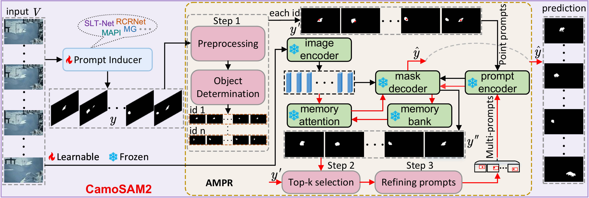
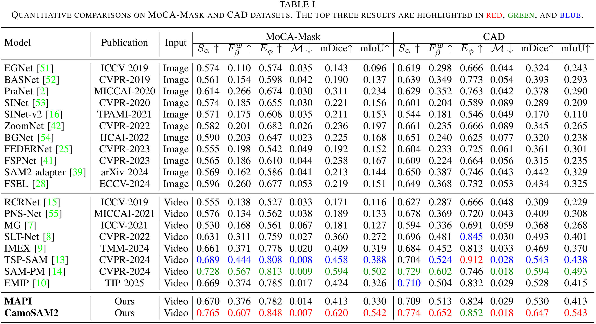
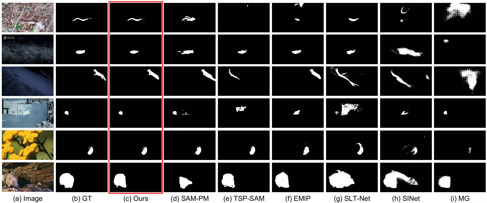

## CamoSAM2: SAM2-oriented Prompt Auto-Refinement for Video Camouflaged Object Detection
This repository contains the code for our paper `CamoSAM2: SAM2-oriented Prompt Auto-Refinement for Video Camouflaged Object Detection`[[arXiv](http://arxiv.org/abs/2504.00375)] 

<p align="left">
     <br />
    <em>
    Figure 1: Pipeline of CamoSAM2,which consists of two main components: a replaceable prompt inducer (e.g.,SLT-Net,RCRNet,
MG,MAPI (Ours),···)and video-based adaptive multi-prompts refinement (AMPR).The fire and snowflake symbol signifies that the
modelparameters in this part are kept learnable and frozen, respectively. Specifically, the red arrow represents the data flow from Step2 to the final predicted result.
    </em>
</p>


## 1. Highlights :fire:

- We identify prompt quality as the key bottleneck in SAM2-based VCOD and propose a unified framework that explicitly addresses both localization accuracy and temporal robustness.
- We propose a more accurately positioned motion appearance prompt inducer, MAPI, which improves object localization and generates informative mask prompts by integrating motion and appearance cues.
- We introduce a training-free adaptive multi-prompts refinement module, AMPR, which enhances prompt reliability by selecting pivotal frames and refining prompts based on temporal consistency.
- Extensive experiments demonstrate that our method achieves significant improvements over state-of-the-art approaches, validating the effectiveness of our design.

## 2. Preparation :memo:

**Requirements.** 

 Install the environment:

 ``conda env create -f environment.yml``

 ``conda activate camosam2``

 You can download SAM2 checkpoint from [SAM2](https://github.com/facebookresearch/sam2).

**Dataset.** 
To evaluate/train our CamoSAM2, you will need to download the required datasets.

* [MoCA-Mask](https://drive.google.com/file/d/1FB24BGVrPOeUpmYbKZJYL5ermqUvBo_6/view?usp=sharing)
* [CAD2016](http://vis-www.cs.umass.edu/motionSegmentation/)
* [COD10K](https://drive.google.com/file/d/1vRYAie0JcNStcSwagmCq55eirGyMYGm5/view)

## 3. Main Results :balloon:

**Training.**

All hyperparameters for model training and inference are located in the `configs/configs.py` file, with corresponding comments for explanation. To start training, run the following code in the command line:

```shell
python train.py
```

**Evaluation.** 
Please run the file  `run_eval.sh`  in `eval` folder to evaluate your model. You could also simply download the images via this [Link](https://drive.google.com/drive/folders/1eqYtJvQLp4qFLFJ12XIx8GQHo6wJbpV8) to reach the results reported in our paper. 

**Quantitative comparisons with state-of-the-arts.** 

<div align=center>

</div>


**Visual comparisons with state-of-the arts.** 

<div align=center>

</div>
## 4. Demo videos :video_camera:

We demonstrate the video results of our CamoSAM2 with previous state-of-the-art models on MoCA-Mask test dataset.


## 5. Citing  CamoSAM2 🤗

If you find CamoSAM2 useful in your research, please consider giving a star ⭐ and citing:
```shell
@article{zhang2025camosam2,
  title={Camosam2: Motion-appearance induced auto-refining prompts for video camouflaged object detection},
  author={Zhang, Xin and Fu, Keren and Zhao, Qijun},
  journal={arXiv preprint arXiv:2504.00375},
  year={2025}
}
```

